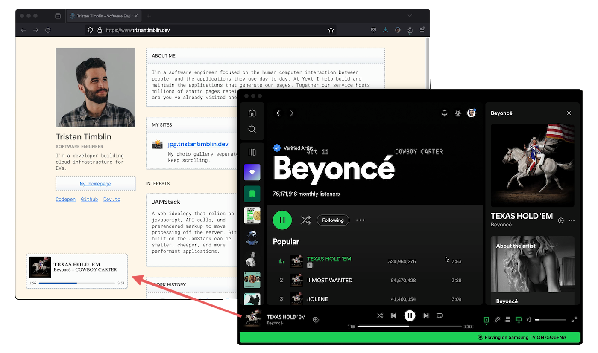

# spotify-stream-player



[Live Demo](https://www.tristantimblin.dev/) | [Video Demo](https://x.com/tatimblin/status/1784282763547615440)


This project is an implementation of a read-only music player similar to the one on your phones lockscreen. It has two parts:

1. Streaming Server: The Spotify Rest API does not have support for event-based data detection. This server sits in between the Spotify and the client, it polls the Spotify API and detects changes to send to the client.
2. Custom Element: The front-end is a small dependency free custom HTML element. This allows for good portability by not tying it into any particular framework.

## Getting Started

### Spotify Authentication

I found Spotify to not have a great out of the box authentication solution for this particular use case. Understandably they are focused on supporting third-party sign-on where each user uses their own account. To obtain long-lived credentials for a particular account you can generate a refresh token (which doesn't expire), the SSE server then immediately uses that to generate a fresh access token.

1. Register a Spotify API app

[https://developer.spotify.com/dashboard](https://developer.spotify.com/dashboard)

Set the Redirect URI to: `http://localhost:3000`

2. Get your Client ID:

On [spotify.com](https://open.spotify.com/) visit your profile and copy the ID from the address bar.

3. Sign-in using a browser

Visit the following page in your browser.
```
https://accounts.spotify.com/authorize?client_id=<CLIENT_ID>&response_type=code&redirect_uri=http%3A%2F%2Flocalhost:3000&scope=user-read-currently-playing%20user-top-read
```

You should receieve a secret token

4. Encode your token

Use a [base64 encoding website](https://www.base64encode.org/) to generate your encryption certificate. Use this format `<CLIENT_ID>:<CLIENT_SECRET>`.

5. Obtain long-lived Refresh Token

In your terminal, run:
```
curl -H "Authorization: Basic <BASE64_CERTIFICATE>" -d grant_type=authorization_code -d code=<code> -d redirect_uri=http%3A%2F%2Flocalhost:3000 https://accounts.spotify.com/api/token
```

### Setup Server

You can deploy the SSE server wherever you like. I chose Google Cloud Run because it supports Server Sent Events, can handle 250 connections on one instance, and is short lived (15min). This suits my needs well of providing a non-critical feature that will be largely be idle.

```
gcloud run deploy spotify-stream-player --region us-east4 --source ./server
```

#### Configuration

The server takes several environment variables for configuration.

* PORT: The port to serve on. i.e. `8080`
* ORIGINS: comma-separated list of allowed origins. i.e. `https://tristantimblin.dev,localhost:5173`
* SPOTIFY_ID
* SPOTIFY_SECRET
* SPOTIFY_REFRESH

### Setup Client

#### Installation

The client can be installed from npm `npm i @tristimb/spotify-stream-player` or by downloading this repo and making your own build `npm run build`.

#### Usage

Import the package or build you just installed and register the Custom Element. Then, reference it in your HTML.

##### js
```
import SpotifyPlayer from "@tristimb/spotify-stream-player";
import "@tristimb/spotify-stream-player/dist/style.css";

customElements.define("spotify-player", SpotifyPlayer);
```

##### html
```
<!doctype html>
<html lang="en">
  <head>
    <title>My Website</title>
  </head>
  <body>
    <div id="app">
      <spotify-player src="http://localhost:8080/" />
    </div>
    <script type="module" src="/demo.ts"></script>
  </body>
</html>
```

##### Examples
- [Vue 2](https://github.com/tatimblin/whois.timblin.io/blob/60f9cc66363fa6f808dfb687637f45456f0ec360/src/components/MusicPlayer.vue)

## Deployment Notes

### Google Cloud Run

```
gcloud run deploy spotify-stream-player --region us-east4 --source ./server
```

### npm Package

```
npm version patch | minor | major
npm publish
```
